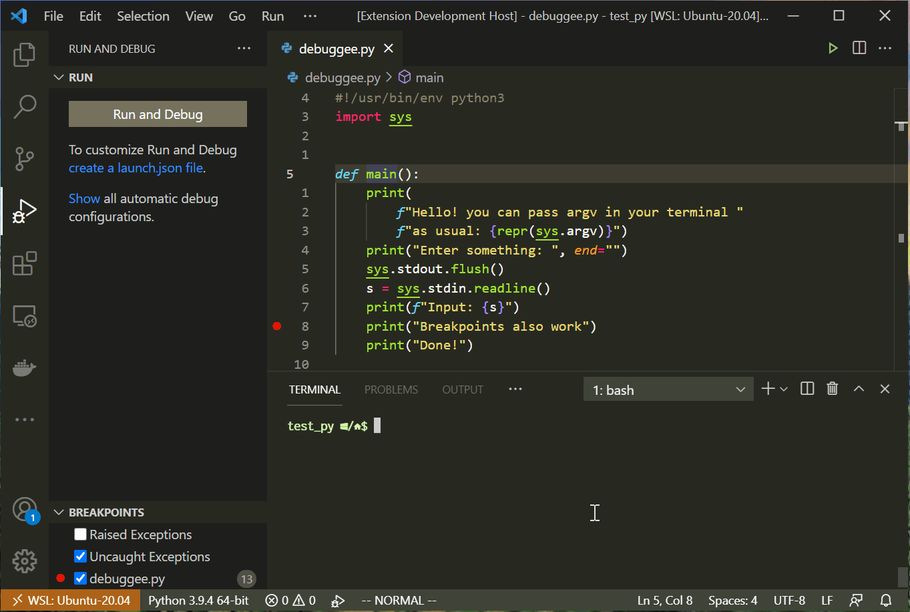

# Dbgee - the Zero-Configuration Debuggee for Debuggers


Dbgee is a handy utility that allows debuggers to be actively started from the debuggee side.
Just start your program by a simple command in a terminal, and a debugger will automatically attach to it with zero configuration.
You don't have to bother with setting arguments, redirects, etc. in `launch.json` in order to start the debugger.
In addition, Dbgee can also launch CLI debuggers in a tmux window or pane.

## Demos

The concept of Dbgee may be unfamiliar to you, so here are a few demos.

### Debug your program with zero configuration in Visual Studio Code



### Configure your program to launch a debugger when it runs


### Launch CUI debuggers in tmux


## Supported languages and platforms

### Languages

The current supported languages are C, C++, Rust, Go, Python and any languages which Gdb, LLDB, or CodeLLDB support.

### Platforms

Currently only Linux (including WSL2 on Windows) is supported. However, adding macOS support is pretty easy and will be added soon if there are any macOS users.
Please say hi to me in a GitHub issue.

## Installation

There are two components, `dbgee` command and the optional VSCode extension.

### `dbgee` command

```shell
curl -L -O https://github.com/nullpo-head/dbgee/releases/download/v0.1.0/dbgee-linux-x64.tar.gz
tar xvf dbgee-linux-x64.tar.gz
mv dbgee /usr/local/bin/ # Or anywhere in the PATH
```

### VSCode extension

Please install "Dbgee" extension from the marketplace.

## Usage

### Run and attach to your program

Use `run` subcommand to launch your program and attach a proper debugger to it.

#### Launch a CLI debugger in a tmux window

By the following command, the proper debugger for your program launches in a new tmux window.

```shell
dbgee run -- ./program arg0 arg1 arg2...
```

You can manually specify your preferred debugger by the `-d` option.

```shell
dbgee run -d lldb -- ./program arg0 arg1 arg2...
```

`dbgee` launches a debugger in a new tmux window unless you run `dbgee` in an integrated terminal in VSCode.
However, you can choose other options by specifying `-t` option. Please see the help for more information.

```shell
dbgee run -t tmuxw -- ./program  arg0 arg1 arg2... # launch a debugger in a new tmux window instead of a window
```

#### Debug your program in VSCode

`dbgee` launches the given debuggee and wait for VSCode to connect to your program
if `dbgee` is running in a VSCode's integrated terminal.
Run the following command, and attach to your program in VSCode as the demo videos.

```shell
dbgee run -- ./program arg0 arg1 arg2...
```

Or, you can use `-t vscode` option to explicitly make `dbgee` wait for VSCode.

```shell
dbgee run -t vscode -- ./program arg0 arg1 arg2...
```

### Automatically attach a debugger when your program is launched

`set` subcommand will automatically attach a debugger to your program, no matter by what means it is started.
This is a very useful feature when your program is launched by some start up scripts in your development flow.
However, please note that `set` command doesn't work if you rebuild your program after you run `set`,
or when your start up scripts incur rebuild, because `set` command works by replacing your program with a wrapper script.

```shell
dbgee set ./program
./program arg0 arg1 arg2  # your program is launched, being attached by the debugger
```

Use `unset` command to stop the debugger from attaching automatically

```shell
dbgee unset ./program
```

If you specify some to launch your program, `dbgee` automatically runs `unset` after your command finishes.

```shell
dbgee set ./program -- ./some_startup_script
```
